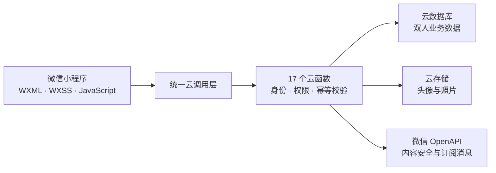

<div align="center">

# LoveSpace

### 把陪伴落在每天可以完成的小事里

一款仅供两个人使用的私密情侣微信小程序。<br>
用每日问答建立连接，用共同记录保存生活，用健康挑战、任务和月报陪两个人长期成长。

[](https://developers.weixin.qq.com/miniprogram/dev/framework/)
[](https://developers.weixin.qq.com/miniprogram/dev/wxcloud/basis/getting-started.html)
[](https://developer.mozilla.org/docs/Web/JavaScript)
[](#项目规模)
[](#项目规模)

[产品能力](#核心体验) · [快速开始](#快速开始) · [部署说明](#云端部署) · [上线清单](docs/RELEASE_CHECKLIST.md)

</div>

---

## LoveSpace 是什么

LoveSpace 不是把大量情侣工具堆在一起，而是围绕一条清晰的关系主线设计：

1. **每天靠近一点**：用每日问答和心情打卡建立稳定、低压力的交流习惯。
2. **一起经历生活**：把照片、点滴、纪念日、愿望、任务和日常选择留在同一个双人空间。
3. **长期看见彼此**：用关系月报、健康周报和回忆时间轴，把零散互动变成可回顾的共同成长。

产品坚持三个原则：仅两人可见、双方身份在服务端校验、数据用于陪伴而不是排名。

## 核心体验

| 场景 | 能力 | 体验重点 |
|---|---|---|
| 每日连接 | 每日问答、双方回答后揭晓、心情打卡 | 先独立表达，再互相看见 |
| 一起变好 | 健康目标、每日运动记录、双人挑战、健康周报 | 比较各自的过去，不比较彼此体重 |
| 保存回忆 | 点滴、相册、纪念日、时间轴、时光胶囊 | 让照片和文字形成长期关系档案 |
| 共同生活 | 任务、愿望、点菜、积分与兑换 | 把商量和承诺变成可以完成的行动 |
| 长期反馈 | 关系月报、恋爱能量、健康趋势 | 用趋势帮助回顾，不把关系数据化评分 |

### 每日问答

- 每天生成一个双人话题。
- 双方分别回答，单方完成时无法查看对方正文。
- 两个人都回答后同时揭晓，避免答案互相影响。

### 一起变好

- 分别设置减脂、增肌或塑形目标。
- 记录运动、步数、饮水、睡眠、饮食和可选体重。
- 通过共同周进度和双人挑战获得积分奖励。
- 体重支持“仅自己”“仅趋势”“双方可见”三级隐私。

### 共同记录

- 相册与点滴支持图片、文字、标签和时间轴回顾。
- 纪念日提供倒计时、重复提醒和置顶展示。
- 时光胶囊在到期前不向任何列表或详情接口返回正文。

## 技术架构



| 层级 | 实现 |
|---|---|
| 客户端 | 微信小程序原生 WXML / WXSS / JavaScript |
| UI 组件 | Vant Weapp `^1.11.0` + 自定义组件与 TabBar |
| 服务端 | 微信云开发云函数，`wx-server-sdk ~2.6.3` |
| 数据 | 云数据库、云存储、服务端事务与确定性幂等 ID |
| 质量检查 | JSON 校验、JavaScript 语法检查、事件绑定检查、微信原生 WXML/WXSS 编译 |

## 安全与隐私

- 客户端不直接访问业务数据库，所有请求经过云函数。
- 云函数根据当前 OpenID、`coupleId` 和情侣成员关系进行授权。
- 积分、兑换、任务奖励和健康挑战奖励使用事务及幂等流水。
- 主要用户文本写入前调用微信内容安全接口。
- 心情可设为仅自己可见，健康体重有独立的三级隐私控制。
- 图片按情侣空间分区上传，云存储路径不由客户端直接指定。

> 正式部署时，业务集合的客户端权限应设置为“所有用户不可读写”，仅允许云函数以服务端权限访问。

## 快速开始

### 环境要求

- 微信开发者工具 Stable
- 已注册的微信小程序 AppID
- 已开通并与 AppID 关联的微信云开发环境
- Node.js 与 npm（用于构建小程序 npm 依赖）

### 1. 获取项目

```bash
git clone https://github.com/PaoPao1021/LoveSpace.git
cd LoveSpace
```

### 2. 配置账号与云环境

1. 在 `project.config.json` 中设置自己的小程序 AppID。
2. 在 `miniprogram/config/index.js` 中设置云环境 ID 和订阅消息模板 ID。

```javascript
module.exports = {
  cloudEnvId: 'your-cloud-env-id',
  orderTemplateId: 'your-template-id'
}
```

这些值与微信小程序账号绑定，复制项目后必须替换为自己的正式环境配置。

### 3. 构建依赖

使用微信开发者工具打开仓库根目录，然后执行：

```text
工具 → 构建 npm
```

### 4. 部署云端资源

按照下方“云端部署”完成集合、云函数和触发器配置，再点击编译和预览。

## 云端部署

### 云函数

在微信开发者工具中，右键每个目录并选择“上传并部署：云端安装依赖”。

```text
login, couple, user, anniversary, album, moments, mood, points,
menu, task, wish, capsule, quiz, notification,
daily-question, monthly-report, fitness
```

部署 `notification` 后需要根据 [notification/config.json](cloudfunctions/notification/config.json) 上传定时触发器。

### 数据库集合

```text
users, couples, couple_invites, anniversaries, albums, photos,
moments, moods, daily_questions, points, point_exchanges,
point_exchange_records, point_balances, dishes, orders,
tasks, wishes, capsules, quizzes, notifications, menu_categories,
fitness_goals, fitness_checkins, fitness_challenges
```

数据库索引、OpenAPI 权限、订阅消息字段和双账号验收步骤见 [上线清单](docs/RELEASE_CHECKLIST.md)。

## 项目结构

```text
LoveSpace/
├── miniprogram/
│   ├── config/               # 云环境与消息模板配置
│   ├── components/           # 通用小程序组件
│   ├── custom-tab-bar/       # 自定义底部导航
│   ├── pages/                # 28 个业务页面
│   ├── utils/                # 云调用、日期、存储与主题工具
│   ├── app.js
│   ├── app.json
│   └── app.wxss
├── cloudfunctions/           # 17 个服务端云函数
├── docs/
│   ├── PRODUCT_AUDIT.md      # 产品与工程审计
│   └── RELEASE_CHECKLIST.md  # 正式上线清单
├── scripts/
│   └── validate-project.ps1  # 项目自动检查
└── project.config.json
```

## 项目规模

当前 `main` 分支包含：

- 28 个小程序页面
- 53 个业务 JavaScript 文件
- 65 个 JSON 配置文件
- 17 个云函数
- 24 个云数据库集合

运行本地质量检查：

```powershell
powershell -NoProfile -ExecutionPolicy Bypass -File .\scripts\validate-project.ps1
```

若本机安装了微信开发者工具，脚本会同时调用微信原生 WXML/WXSS 编译器。检查必须以退出码 `0` 结束。

## 上线前必读

当前仓库提供完整可运行的客户端与云函数代码，但云环境资源不会随 Git 自动创建。正式预览或提审前需要完成：

- 创建 24 个数据库集合并配置客户端权限。
- 部署 17 个云函数及其 `config.json` 权限。
- 上传 `notification` 定时触发器。
- 配置正式订阅消息模板和隐私保护指引。
- 使用两个真实微信账号完成双端验收。

请逐项执行 [LoveSpace 上线清单](docs/RELEASE_CHECKLIST.md)。

## 反馈与协作

发现问题或有产品建议，欢迎通过 [GitHub Issues](https://github.com/PaoPao1021/LoveSpace/issues) 提交。涉及安全或隐私的数据请勿直接粘贴到公开 Issue。

## 致谢

- [Vant Weapp](https://github.com/youzan/vant-weapp) 提供稳定的小程序 UI 基础组件。
- [微信小程序](https://developers.weixin.qq.com/miniprogram/dev/framework/) 与 [微信云开发](https://developers.weixin.qq.com/miniprogram/dev/wxcloud/basis/getting-started.html) 提供运行平台。

---

<div align="center">

**每天五分钟，把爱落在具体的小事里。**

</div>
